# Building a Serverless REST API with SAM, PYTHON and API GATEWAY

#### Problem Statement

#### Problem
We need to build a `serverless` `weather` `REST API` that is easy to use. The `API` should be able to `store`, `retrieve` `weather data` with respect to the users request.

#### Solution:
We will use `AWS SAM` to `build` and `deploy` the `API`. `SAM` is a `serverless` framework that makes it easy to `build` and `deploy` `serverless` applications on `AWS`. We will use `Python` to write the code for the `API`. `Python` is a popular `programming language` that is well-suited for building `serverless` applications. `API Gateway `is a fully managed service that makes it easy to `create`, `deploy`, and `manage RESTful APIs`.

#### Benefits:
The benefits of building a `serverless` weather REST API with SAM, Python and API Gateway include:

A good start for beginners to master `AWS Service` with hands on projects

Easy understanding of IaC (Infrastructure as code) for beginners.

`Scalability`: The API will be scalable, so that it can handle a large number of requests.

`Cost-effectiveness`: The API will be cost-effective, as it will be hosted on AWS Lambda, which is a serverless compute service that only charges for the amount of time that the API is running.

## Prerequisite
1. [AWS Account](https://aws.amazon.com/). Amazon Web Services (AWS) is the world's most comprehensive and broadly adopted cloud, offering over 200 fully featured services from data centers globally.
2. [AWS Command Line Interface (AWS CLI)](https://awscli.amazonaws.com/AWSCLIV2.msi). The AWS CLI provides direct access to the public APIs of AWS services. You can explore a service's capabilities with the AWS CLI, and develop shell scripts to manage your resources
3. [ AWS SAM CLI](https://github.com/aws/aws-sam-cli/releases/latest/download/AWS_SAM_CLI_64_PY3.msi). AWS Serverless Application Model Command Line Interface, provides a Lambda-like execution environment that lets you locally build, test, and debug applications defined by SAM templates or through the AWS Cloud Development Kit (CDK)
4. [Python](https://www.python.org/ftp/python/3.11.4/python-3.11.4-amd64.exe). The programming language used in this project
5. [VS Code](https://code.visualstudio.com/download) or Your favourite text editor.
6. [Postman](https://www.postman.com/downloads/). Postman is an API platform for building and using APIs. Postman simplifies each step of the API lifecycle and streamlines collaboration so you can create better APIs—faster.


## AWS Services used

1. [AWS SAM ](https://aws.amazon.com/serverless/sam/) To define the infrastructure : The AWS Serverless Application Model (SAM) is an open-source framework for building serverless applications. It provides shorthand syntax to express functions, APIs, databases, and event source mappings. With just a few lines per resource, you can define the application you want and model it using YAML. There is no additional charge to use AWS SAM. You pay for the AWS resources created using SAM in the same manner as if you created them manually. You only pay for what you use, as you use it. There are no minimum fees and no required upfront commitments.
2. [Amazon API Gateway](https://aws.amazon.com/api-gateway/):Amazon API Gateway is a fully managed service that makes it easy for developers to create, publish, maintain, monitor, and secure APIs at any scale. With Amazon API Gateway, you only pay when your APIs are in use. There are no minimum fees or upfront commitments
3. [AWS Lambda](https://aws.amazon.com/lambda/) : AWS Lambda is a serverless, event-driven compute service that lets you run code for virtually any type of application or backend service without provisioning or managing servers. You can trigger Lambda from over 200 AWS services and software as a service (SaaS) applications, and only pay for what you use. Cost of using lambda functions.
 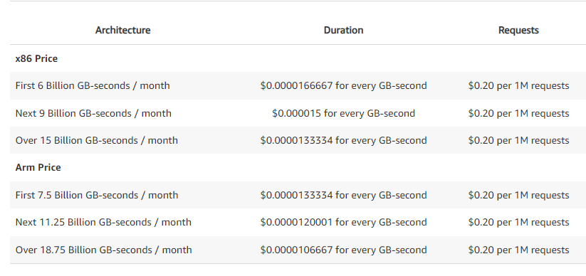

### Installing SAM CLI

To install `AWS SAM CLI`, click [here](https://aws.amazon.com/serverless/sam/) to download `SAM CLI` for your device `OS`.

Launch the installer package (the downloaded file) and install SAM CLI

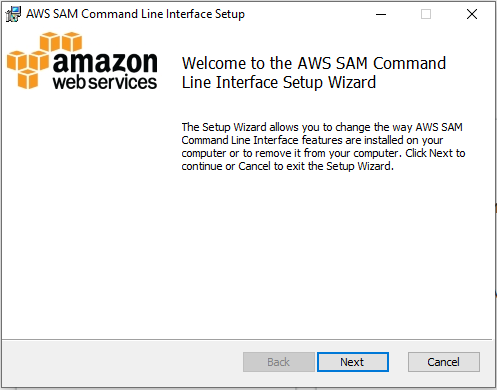

Click `Next` to continue.

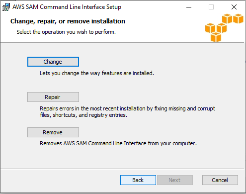

You can either `Remove` `SAM` from you device if you already have it installed, `Repair error` by fixing missing and corrupt files, `Change` that allows you change the way features are installed in your device.

Click on `Change` to continue.

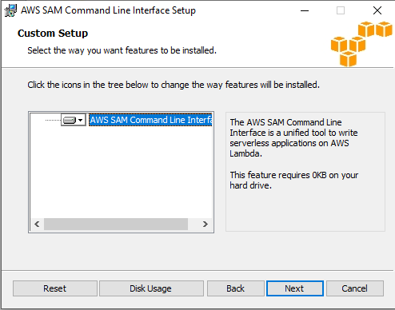

click `Next` to continue installation on default location.

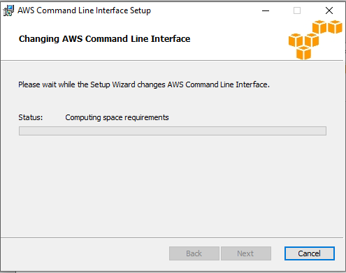

When the installation is done, click `Finish` button.


Now open you `terminal` or `command prompt` by clicking  `start` or `windows` on the keyboard and search for `cmd` and hit `enter`

Run the command `sam --version` to check the `version` of `SAM` installed

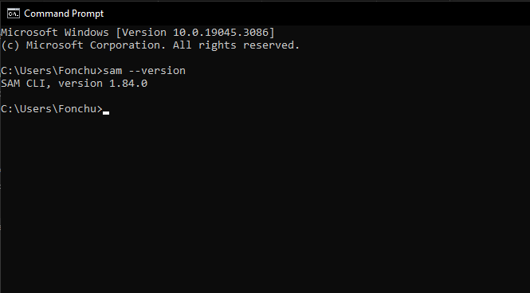

`SAM CLI`, `version 1.84.0`


### Installing AWS CLI

To install `AWS CLI`, click [here](https://aws.amazon.com/serverless/sam/) to download `AWS CLI` for your device `OS`.

Launch the installer package (the downloaded file) and install SAM CLI

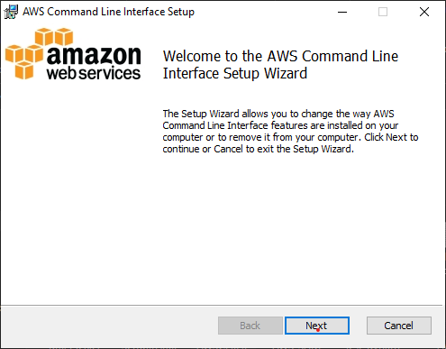

Click `Next` to continue.

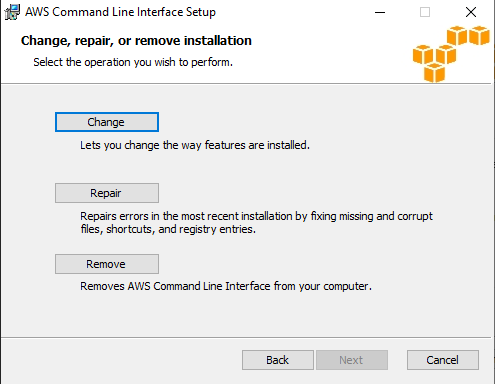

You can either `Remove` `AWS CLI` from you device if you already have it installed, `Repair error` by fixing missing and corrupt files, `Change` that allows you change the way features are installed in your device.

Click on `Change` to continue.

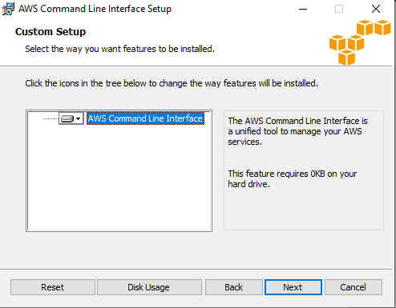

click `Next` to continue installation on default location.

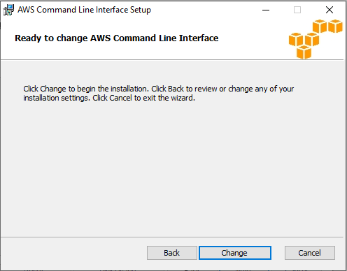

click `Next` to continue installation on default location.


When installation is done, click `Finish` button. and open `terminal` or `command prompt` and run the command `aws --version`

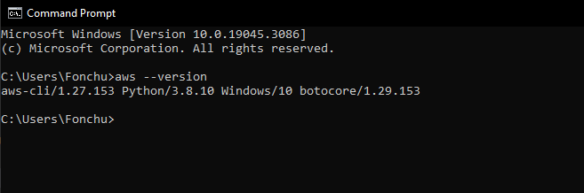

`aws-cli/1.27.153` AWS CLI version
`Python/3.*.*` Version of python installed in your device.
`Windows/10` The OS of your device.
`botocore/1.29.153` Python library to access AWS services.


Now open you `terminal` or `command prompt` by clicking  `start` or `windows` on the keyboard and search for `cmd` and hit `enter`

Run the command `sam --version` to check the `version` of `SAM` installed


`SAM CLI`, `version 1.84.0`


## Creating a SAM Project
1. To kick off your new SAM application, `sam init` command, you'll be on your way to a brand new directory and a set of default templates to work with.


```
projectName
├── event
    ├── events.json
├── hello_world
    ├── _init_.py
    ├── app.py
    ├── requirements.txt
├── test
├── __init__.py
├── samconfig.toml
├── README.md
└── template.yaml
```


**Let's take the default and give it a little shakeup modification**

Rename the hello_world folder to src.
you can delete all files except ```samconfig.toml``` and ```template.yaml```.


    projectName
    ├── src
    ├── samconfig.toml
    ├── README.md
    └── template.yaml

#### Libraries Used in this Project
1. [Boto3]() is the AWS SDK for Python. It provides a high-level, object-oriented API for interacting with AWS services.
2. [Json](https://docs.python.org/3/library/json.html). The json library can parse JSON from strings or files. The library parses JSON into a Python dictionary or list. It can also convert Python dictionaries or lists into JSON strings.
3. [Random](https://docs.python.org/3/library/random.html) library. Use to generate random numbers used as item's id.


## Create Lambda Function
The first lambda will be to ```create/insert``` an item.
In the ```src``` folder create file with name ```createWeatherHandler.py```

 Create a lambda handler function that is used to create items on dynamodb.

 A ```POST``` request is sent through an ```API``` that contains ```weather``` infomation in the body.


#### Methods used.

The line below creates an instance of ```dynamodb_client```
```python
  dynamodb_client = boto3.client('dynamodb')
  ```

  ```loads()``` parses JSON into a Python dictionary or list


```python
 json.loads(event['body'])
 ```

```put_item()``` method that takes ```table name``` of type ```string```, ```Item``` of type dictionary as arguments and ```create/insert``` in the specified table
```python
dynamodb_client.put_item(TableName='WeatherData', Item={'id': {'S': id}, 'Weather': {'S': Weather}})
      
 ```
```randrange()``` takes two arguments ```lower bound``` , ```upper bound``` and return a random number withing the boundaries.


```python
id = random.randrange(100, 999)
 ```

```str()``` used to parse ```numbers/integers``` to ```Strings```


**Final Lambda to ```create/insert``` a ```weather``` item to ```WeatherData``` table in ```Dynamodb```**

  ```python
    import boto3
    import json
    import random
    
    dynamodb_client = boto3.client('dynamodb')

    def createWeather(event, context):
        Weather = json.loads(event['body'])['Weather']
        id = str(random.randrange(100, 999))
        dynamodb_client.put_item(TableName='WeatherData', Item={'id': {'S': id}, 'Weather': {'S': Weather}})
        return {
            'statusCode': 200,
            'body': 'Successfully inserted data!'
        }
  ```
### Lambda Arguments
[Event](https://aws-lambda-for-python-developers.readthedocs.io/en/latest/02_event_and_context/)  is the data that's passed to the function upon execution.

[Context](https://aws-lambda-for-python-developers.readthedocs.io/en/latest/02_event_and_context/) is a Python objects that implements methods and has attributes. It's main role is to provide information about the current execution environment.


You can  ```print(event)``` and  ```print(context)``` to see their contents. 

*To see ```event``` and ```context``` when the api is invoke, open your AWS account and search for lambda, open the lambda function with the corresponding ```createWeather```, Click on ```monitor``` and click on ```Cloudwatch```*

#### Adding ```createLambda``` to ```template.yaml```
Save your file and open ```template.yaml``` file

```yaml
Resources
  MyApi:
    Type: AWS::Serverless::Api
    Properties:
      StageName: Prod

  CreateWeather:
    Type: AWS::Serverless::Function
    Description: 'Lambda function inserts data into DynamoDB table'
    Properties:
      FunctionName: CreateWeather
      Handler: createWeatherHandler.lambda_handler
      Runtime: python3.10
      CodeUri: src/
      Policies:
        DynamoDBCrudPolicy:
          TableName: !Ref DynamoDBTable
      Events:
        ApiEvent:
          Type: Api
          Properties:
            Path: /
            Method: POST
 ```
4. Configure dynamodb table in ```yaml``` by adding the code snippet bellow.
```yaml
  DynamoDBTable:
    Type: AWS::Serverless::SimpleTable
    Properties:
      TableName: WeatherData
```
## Get Weather Lambda Function
Create a new file ```getWeatherHandler.py``` in ```src``` folder and add the code bellow 


####  Methods used.

The line below creates an instance of ```dynamodb``` ```resource```
```python
  dynamodb = boto3.resource('dynamodb')
  ```

  ```Table()``` that takes ```table name``` as parameter to create an instance of that ```dynamodb table```


```python
 table = dynamodb.Table('TableName')
 ```

```scan()``` method that takes ```table name``` as argument, ```retrieves``` all the items in dynamodb
```python
table.scan(TableName='WeatherData')
 ```

```dumps() ``` converts the python ```dictionary``` to ```json```

```python
  json.dumps(response['Items'])
 ```
**Final Lambda to ```get``` all ```weather``` from ```WeatherData``` table in ```Dynamodb```**
  ```python
    import boto3
    import json
    
    dynamodb = boto3.resource('dynamodb')

    def getAllWeather(event, context):
      table = dynamodb.Table('WeatherData')
      response = table.scan(TableName='WeatherData')
      print(response)
      return {
        'statusCode': 200,
        'body': json.dumps(response['Items'])
      }
  ```


##### Adding the function in ```yaml``` 
```yaml
  GetWeatherFunction:
    Type: AWS::Serverless::Function
    Description: 'Lambda function inserts data into DynamoDB table'
    Properties:
      FunctionName: GetAllWeatherFunction
      Handler: getWeatherHandler.getAllWeather
      Runtime: python3.10
      CodeUri: src/
      Policies:
        DynamoDBCrudPolicy:
          TableName: !Ref DynamoDBTable
      Events:
        ApiEvent:
          Type: Api
          Properties:
            Path: /
            Method: GET
```
## Get Weather Lambda Function
Create a new file ```deleteWeatherHandler.py``` in ```src``` folder and add the code bellow 

#### Methods used
```delete_item()``` takes the ```id``` as the ```Key``` and removes the item from dynamodb.

```python
table.delete_item(
        Key = {
            "id": key
        }
    )
 ```

**Final Lambda to ```delete``` a single ```weather``` from ```WeatherData``` table in ```Dynamodb```**


```python

import boto3
import json


dynamodb = boto3.resource('dynamodb')

def DeleteWeather(event, context):
    table = dynamodb.Table('WeatherData')
    key = json.loads(event['body'])['id']
    table.delete_item(
        Key = {
            "id": key
        }
    )
    return {
        'statusCode' : 200,
        'body': "Delete Succeessfull"
    }
  ```
##### Adding the function in ```yaml``` 
```yaml

  DeleteWeatherFunction:
    Type: AWS::Serverless::Function
    Description: 'Lambda function inserts data into DynamoDB table'
    Properties:
      FunctionName: DeleteWeatherFunction
      Handler: DeleteWeatherHandler.DeleteWeather
      Runtime: python3.10
      CodeUri: src/
      Policies:
        DynamoDBCrudPolicy:
          TableName: !Ref DynamoDBTable
      Events:
        ApiEvent:
          Type: Api
          Properties:
            Path: /
            Method: DELETE
 ```
## Update Weather Lambda Function
An item already registered in dynamodb can be update by providing its ```id``` and the ```attributes``` you want to update with new content.
#### Methods used
```put_item()``` takes the ```table name``` and data for the item to be updated e.g ```id``` which is ```required```, ```weather```

```python
table.put_item(
        Key = {
            "id": key
        }
    )
 ```

Create a new file ```updateWeatherHandler.py``` in ```src``` folder and add the code bellow 


```python
import boto3
import json


def updateWeather(event, context):
  Weather = json.loads(event['body'])['weather']
  key = json.loads(event['body'])['id']
  dynamodb_client.put_item(TableName='WeatherData', Item={'id': {'S': key}, 'Weather': {'S': Weather}})
  return {
      'statusCode': 200,
      'body': 'Data Updated Successfully!'
  }
  ```

Final Project folder structure

    projectName
    ├── src
        ├── createWeatherHandler.py
        ├── getWeatherHandler.py
        ├── deleteWeatherHandler.py
        ├── updateWeatherHandler.py
        ├── requirements.txt
    ├── samconfig.toml
    ├── README.md
    └── template.yaml

##### Building and Deploying the application

1.  Build your application. Use the ```sam build``` command to build your application. This will create a ZIP file that contains your application code and dependencies.
2.  Deploy your application. Use the ```sam deploy --guided``` command to deploy your application. This will create the AWS resources defined in your template and deploy your application code.


## Testing the end points

```Postman``` will be used to ```test``` our ```endpoints```

##### 1. Create Weather Item.
**Method :** ```POST```

**Body Payload :**
```json
{
  "Weather": "Rainy"
}
```

**Response Payload :**
```json
{
  "Message": "Successfully Inserted"
}
```

**Postman Preview**


#### 2. Get All Weather Item.
Open postman and send a get request to your end point.
**Method :** ```GET```

**Body Payload :**

**Response Payload :**
```json
[{
  "id": "123",
  "Weather": "Rainy"
}]
 ```

 **Postman Preview**


Currently, The endpoints we have can be accessed by any body and that is not what we want.
Lets add Authorization such that without the Cognito token, you cannot access our API's

## Adding Authorization with Cognito

Implementing ```cognito``` ```authorization``` to the ```Rest APIs```


##### Creating cognito user pool

 Open your aws console and Create cognito user pool. Click [here]() for help.

##### YAML cognito configuration

To configure authorization with with ```cognito```, open ```template.yaml``` file

Add the below code to ```MyApi```  ```resource``` in your ```yaml file```
```yaml
      Cors: "'*'"
      Auth:
        DefaultAuthorizer: CognitoAuthorizer
        Authorizers:
          CognitoAuthorizer:
            UserPoolArn: !GetAtt WeatherUserPool.Arn
  ```


 Add ```cognitoUserPool``` and ```UserPoolClient``` configuration ```resource``` in  ```yaml file```


```yaml
  WeatherUserPool:
    Type: AWS::Cognito::UserPool
    Properties:
      UserPoolName: !Ref UserPoolName
      Policies:
        PasswordPolicy:
          MinimumLength: 8
      UsernameAttributes:
        - email
      Schema:
        - AttributeDataType: String
          Name: email
          Required: false
  
  WeatherUserPoolClient:
    Type: AWS::Cognito::UserPoolClient
    Properties:
      UserPoolId: !Ref UserPoolId
      ClientName: !Ref ClientName
      GenerateSecret: false    
```

#### Referencing RestApiId

Add the code bellow as ```ApiEvent``` ```property``` in all the the ```lambda``` functions.

```yaml
RestApiId: !Ref MyApi
 ```

Get the final ```template.yaml``` file [here]().

Run ```sam build``` to build your recent changes.

Run ```sam deploy``` to deploy your recent changes.

Try to access your api again.


To be able to access the api, do the following in postman

click on  ```authorization```


Now Click on the ```Generate```

Login Screen pops up.
Sign up with your email


Another screen with pop that contains the IdToken and AccessToken


Copy the IdToken and change the ```type``` to ```Bearee token``` 


Paste the copied token on the space for ```Token```

Once you are done you can click on send.


Open postman and send a post request to your end point.


To Know more about cognito, click [here](https://github.com/vernyuy/intro_to_cognito/blob/main/cognito.md)

Reference

[Educloud](educloud.academy).

👍👏👍