# Building an API with SAM + Python + Cognito + Dynamodb + API Gateway + Lambda

This doc if focused on building authorization api that only users with cognito token can access the api and perform CRUD operations.

#### Requirements
1. Python
2. SAM
3. Aws account


jksjdlkskd
1. Initialize a new SAM application. Use the ```sam init``` command to initialize a new SAM application. This will create a directory for your application and download a default template.


```
projectName
├── event
    ├── events.json
├── hello_world
    ├── _init_.py
    ├── app.py
    ├── requirements.txt
├── test
├── __init__.py
├── samconfig.toml
├── README.md
└── template.yaml
```


<!-- 2. Build your application. Use the command ```sam build``` to build you your application. This will create a ZIP file that contains your application code and dependencies.
3. Deploy your application. Use the ```sam deploy``` command to deploy your application. This will create the AWS resources defined in your template and deploy your application code.
4. View your application by ```curl https://<API_ENDPOINT>/hello```
5. You will get the following response ```Hello, World!```
 -->

**Now Lets go ahead and modify the default application to accomplish our target.**

Modify the hello_world folder to src.
you can delete any other folder and file except samconfig.toml and template.yaml.

The final folder structure

    projectName
    ├── src
        ├── app.py
        ├── requirements.txt
    ├── samconfig.toml
    ├── README.md
    └── template.yaml

Open you app.py and import the neccessary libraries.

    import boto3
    import json
    from boto3.dynamodb.conditions import Key, Attr
    import random

1. Boto3 is the AWS SDK for Python. It provides a high-level, object-oriented API for interacting with AWS services.


2. Create a lambda handler function that is used to create items on dynamodb


    ```python
    def createWeather(event, context):
        print(event)
        print(context)
        Weather = json.loads(event['body'])['Weather']
        print(Weather)
        id = str(random.randrange(100, 999))
        dynamodb_client.put_item(TableName='WeatherData', Item={'id': {'S': id}, 'Weather': {'S': Weather}})
        return {
            'statusCode': 200,
            'body': 'Successfully inserted data!'
        }
        ```

You can print out the event and the context to see their contents. (To see this when the api is invoke, open your AWS account and search for lambda, open the lambda function with the corresponding ```createWeather```, Click on ```monitor``` and click on ```Cloudwatch```)

3. Save your file and open ```template.yaml``` file

```python
Resources
  MyApi:
    Type: AWS::Serverless::Api
    Properties:
      StageName: Prod

  LambdaFunction:
    Type: AWS::Serverless::Function
    Description: 'Lambda function inserts data into DynamoDB table'
    Properties:
      FunctionName: WeatherFunction
      Handler: app.createWeather
      Runtime: python3.7
      CodeUri: src/
      Policies:
        DynamoDBCrudPolicy:
          TableName: !Ref DynamoDBTable
      Events:
        ApiEvent:
          Type: Api
          Properties:
            Path: /
            Method: POST
```
4. Congifuge dynamodb table name by adding the code snippet bellow.
```yaml
  DynamoDBTable:
    Type: AWS::Serverless::SimpleTable
    Properties:
      TableName: WeatherData
```

5. Repeat ```step 2 and 3 ``` above to add other lambda handlers
6. Lambda handler to get items from dynamodb

```python
def getWeather(event, context):
  table = dynamodb.Table('WeatherData')
  response = table.scan(TableName='WeatherData')
  print(response)
  return {
    'statusCode': 200,
    'body': json.dumps(response['Items'])
  }
  ```

7.  Lambda handler to delete an item from dynamodb

```python
def DeleteWeather(event, context):
    table = dynamodb.Table('WeatherData')
    key = json.loads(event['body'])['id']
    table.delete_item(
        Key = {
            "id": key
        }
    )
    return {
        'statusCode' : 200,
        'body': "Delete Succeessfull"
    }
  ```
7.  Lambda handler to delete an item from dynamodb

```python
def updateWeather(event, context):
  Weather = json.loads(event['body'])['weather']
  key = json.loads(event['body'])['id']
  dynamodb_client.put_item(TableName='WeatherData', Item={'id': {'S': key}, 'Weather': {'S': Weather}})
  return {
      'statusCode': 200,
      'body': 'Data Updated Successfully!'
  }
  ```

8. Adjusting the the ```template.yaml``` by adding the corresponding methonds and routes.
   ```yaml
    GetLambdaFunction:
    Type: AWS::Serverless::Function
    Description: 'Lambda function inserts data into DynamoDB table'
    Properties:
      FunctionName: GetWeatherFunction
      Handler: app.getWeather
      Runtime: python3.7
      CodeUri: src/
      Policies:
        DynamoDBCrudPolicy:
          TableName: !Ref DynamoDBTable
      Events:
        ApiEvent:
          Type: Api
          Properties:
            Path: /
            Method: GET

    DeleteLambdaFunction:
    Type: AWS::Serverless::Function
    Description: 'Lambda function inserts data into DynamoDB table'
    Properties:
      FunctionName: DeleteWeatherFunction
      Handler: app.DeleteWeather
      Runtime: python3.7
      CodeUri: src/
      Policies:
        DynamoDBCrudPolicy:
          TableName: !Ref DynamoDBTable
      Events:
        ApiEvent:
          Type: Api
          Properties:
            Path: /
            Method: DELETE 

    UpdateLambdaFunction:
    Type: AWS::Serverless::Function
    Description: 'Lambda function inserts data into DynamoDB table'
    Properties:
      FunctionName: UpdateWeatherFunction
      Handler: app.updateWeather
      Runtime: python3.7
      CodeUri: src/
      Policies:
        DynamoDBCrudPolicy:
          TableName: !Ref DynamoDBTable
      Events:
        ApiEvent:
          Type: Api
          Properties:
            Path: /
            Method: PUT   
   ```


   The final template.yaml file

```yaml
AWSTemplateFormatVersion: '2010-09-09'
Transform: AWS::Serverless-2016-10-31
Description: Serverless patterns - Amazon API Gateway to AWS Lambda to Amazon DynamoDB
Resources:
  MyApi:
    Type: AWS::Serverless::Api
    Properties:
      StageName: Prod

  LambdaFunction:
    Type: AWS::Serverless::Function
    Description: 'Lambda function inserts data into DynamoDB table'
    Properties:
      FunctionName: WeatherFunction
      Handler: index.lambda_handler
      Runtime: python3.7
      CodeUri: src/
      Policies:
        DynamoDBCrudPolicy:
          TableName: !Ref DynamoDBTable
      Events:
        ApiEvent:
          Type: Api
          Properties:
            Path: /
            Method: POST

  GetLambdaFunction:
    Type: AWS::Serverless::Function
    Description: 'Lambda function inserts data into DynamoDB table'
    Properties:
      FunctionName: GetWeatherFunction
      Handler: index.getWeather
      Runtime: python3.7
      CodeUri: src/
      Policies:
        DynamoDBCrudPolicy:
          TableName: !Ref DynamoDBTable
      Events:
        ApiEvent:
          Type: Api
          Properties:
            Path: /
            Method: GET
            
  DeleteLambdaFunction:
    Type: AWS::Serverless::Function
    Description: 'Lambda function inserts data into DynamoDB table'
    Properties:
      FunctionName: DeleteWeatherFunction
      Handler: index.DeleteWeather
      Runtime: python3.7
      CodeUri: src/
      Policies:
        DynamoDBCrudPolicy:
          TableName: !Ref DynamoDBTable
      Events:
        ApiEvent:
          Type: Api
          Properties:
            Path: /
            Method: DELETE 

  UpdateLambdaFunction:
    Type: AWS::Serverless::Function
    Description: 'Lambda function inserts data into DynamoDB table'
    Properties:
      FunctionName: UpdateWeatherFunction
      Handler: index.updateWeather
      Runtime: python3.7
      CodeUri: src/
      Policies:
        DynamoDBCrudPolicy:
          TableName: !Ref DynamoDBTable
      Events:
        ApiEvent:
          Type: Api
          Properties:
            Path: /
            Method: PUT 
     

  DynamoDBTable:
    Type: AWS::Serverless::SimpleTable
    Properties:
      TableName: WeatherData
Outputs:
  EndpointUrl:
    Description: 'HTTP REST endpoint URL'
    Value: !Sub 'https://${ServerlessRestApi}.execute-api.${AWS::Region}.amazonaws.com/Prod'
   ```

10. Build your application. Use the ```sam build``` command to build your application. This will create a ZIP file that contains your application code and dependencies.
11. Deploy your application. Use the ```sam deploy --guided``` command to deploy your application. This will create the AWS resources defined in your template and deploy your application code.


### Testing the end points

Open postman and send a post request to your end point.

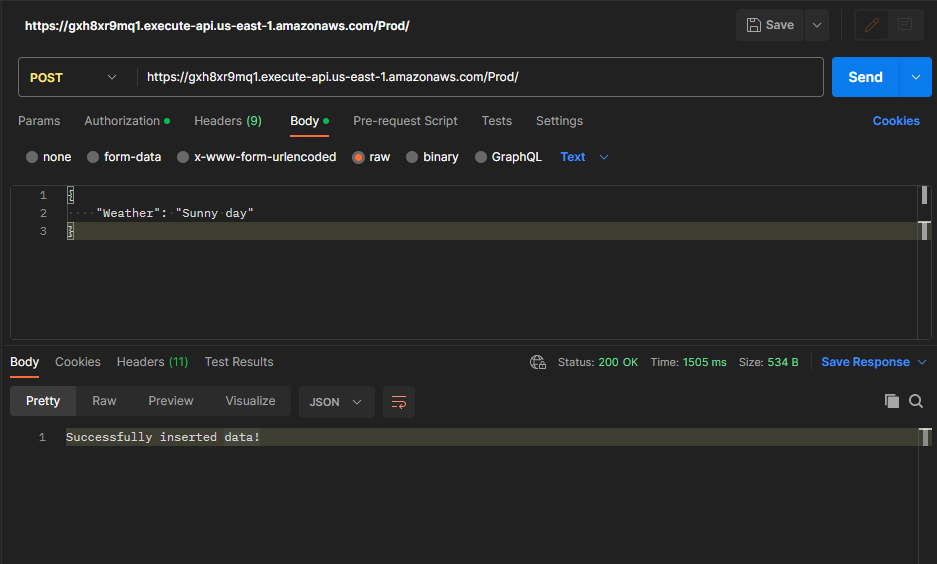

Open postman and send a post request to your end point.

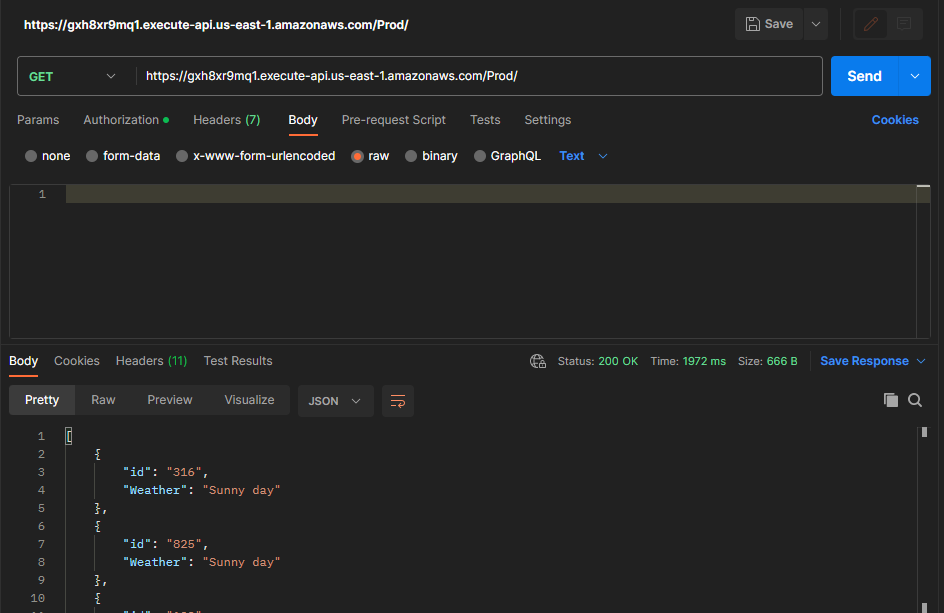

Currently, The endpoints we have can be accessed by any body and that is not what we want.
Lets add Authorization such that without the Cognito token, you cannot access our API's
## Adding Authorization with Cognito

To Add authorization with cognito follow the following steps.
1. Open your aws console and Create cognito user pool
2. Configure your ```template.yaml``` file
3. Add the below code to ```MyApi``` in the ```resources``` in your ```yaml file```
```yaml
      Cors: "'*'"
      Auth:
        DefaultAuthorizer: CognitoAuthorizer
        Authorizers:
          CognitoAuthorizer:
            UserPoolArn: yourUserPoolArn
```
Resulting code after adding the snippet above
  ```yaml
  MyApi:
    Type: AWS::Serverless::Api
    Properties:
      StageName: Prod
      Cors: "'*'"
      Auth:
        DefaultAuthorizer: CognitoAuthorizer
        Authorizers:
          CognitoAuthorizer:
            UserPoolArn: yourUserPoolArn
```

4. Add user cognito properties to the ```resources``` int the ```yaml file```

```yaml
  MyCognitoUserPool:
    Type: AWS::Cognito::UserPool
    Properties:
      UserPoolName: test1
      Policies:
        PasswordPolicy:
          MinimumLength: 8
      UsernameAttributes:
        - email
      Schema:
        - AttributeDataType: String
          Name: email
          Required: false
  
  MyCognitoUserPoolClient:
    Type: AWS::Cognito::UserPoolClient
    Properties:
      UserPoolId: yourUserPoolId
      ClientName: YourClientName
      GenerateSecret: false     
```

After Adding the above code, your final yaml file will look like this.

```yaml
AWSTemplateFormatVersion: '2010-09-09'
Transform: AWS::Serverless-2016-10-31
Description: Serverless patterns - Amazon API Gateway to AWS Lambda to Amazon DynamoDB
Resources:
  MyApi:
    Type: AWS::Serverless::Api
    Properties:
      StageName: Prod
      Cors: "'*'"
      Auth:
        DefaultAuthorizer: CognitoAuthorizer
        Authorizers:
          CognitoAuthorizer:
            UserPoolArn: YourUserPoolArn

  LambdaFunction:
    Type: AWS::Serverless::Function
    Description: 'Lambda function inserts data into DynamoDB table'
    Properties:
      FunctionName: WeatherFunction
      Handler: index.lambda_handler
      Runtime: python3.7
      CodeUri: src/
      Policies:
        DynamoDBCrudPolicy:
          TableName: !Ref DynamoDBTable
      Events:
        ApiEvent:
          Type: Api
          Properties:
            Path: /
            Method: POST
            RestApiId: !Ref MyApi

  GetLambdaFunction:
    Type: AWS::Serverless::Function
    Description: 'Lambda function inserts data into DynamoDB table'
    Properties:
      FunctionName: GetWeatherFunction
      Handler: index.getWeather
      Runtime: python3.7
      CodeUri: src/
      Policies:
        DynamoDBCrudPolicy:
          TableName: !Ref DynamoDBTable
      Events:
        ApiEvent:
          Type: Api
          Properties:
            Path: /
            Method: GET
            RestApiId: !Ref MyApi
            
  DeleteLambdaFunction:
    Type: AWS::Serverless::Function
    Description: 'Lambda function inserts data into DynamoDB table'
    Properties:
      FunctionName: DeleteWeatherFunction
      Handler: index.DeleteWeather
      Runtime: python3.7
      CodeUri: src/
      Policies:
        DynamoDBCrudPolicy:
          TableName: !Ref DynamoDBTable
      Events:
        ApiEvent:
          Type: Api
          Properties:
            Path: /
            Method: DELETE 
            RestApiId: !Ref MyApi 

  UpdateLambdaFunction:
    Type: AWS::Serverless::Function
    Description: 'Lambda function inserts data into DynamoDB table'
    Properties:
      FunctionName: UpdateWeatherFunction
      Handler: index.updateWeather
      Runtime: python3.7
      CodeUri: src/
      Policies:
        DynamoDBCrudPolicy:
          TableName: !Ref DynamoDBTable
      Events:
        ApiEvent:
          Type: Api
          Properties:
            RestApiId: !Ref MyApi 
            Path: /
            Method: PUT 

  MyCognitoUserPool:
    Type: AWS::Cognito::UserPool
    Properties:
      UserPoolName: YourUserPoolName
      Policies:
        PasswordPolicy:
          MinimumLength: 8
      UsernameAttributes:
        - email
      Schema:
        - AttributeDataType: String
          Name: email
          Required: false
  
  MyCognitoUserPoolClient:
    Type: AWS::Cognito::UserPoolClient
    Properties:
      UserPoolId: YourUserPoolId
      ClientName: YourClientName
      GenerateSecret: false       

  DynamoDBTable:
    Type: AWS::Serverless::SimpleTable
    Properties:
      TableName: WeatherData
```

Run ```sam deploy``` to deploy your recent changes.

if you try to access your api again

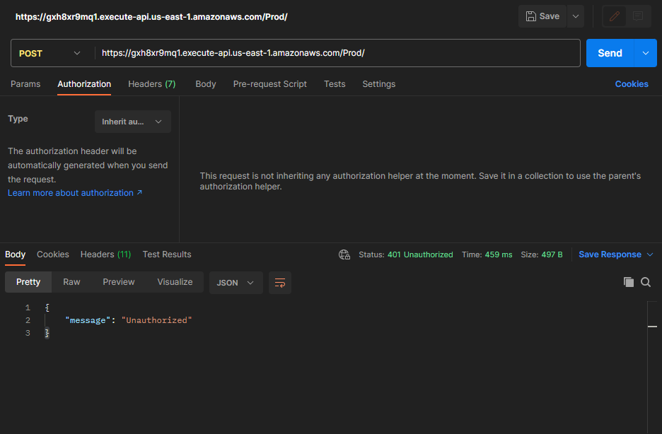

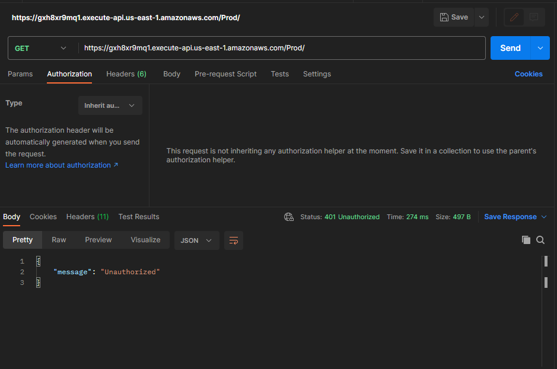

To be able to access the api, do the following in postman

click on  ```authorization```

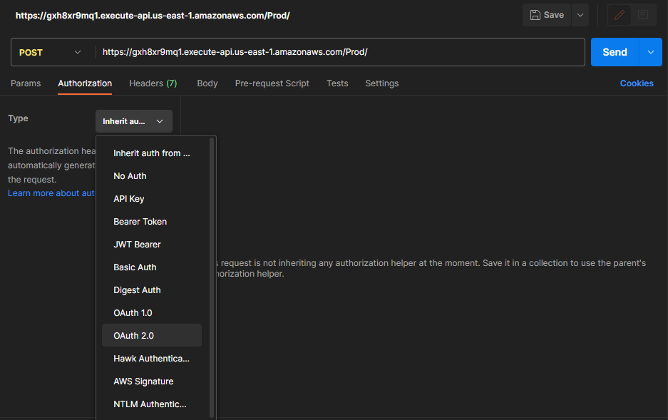

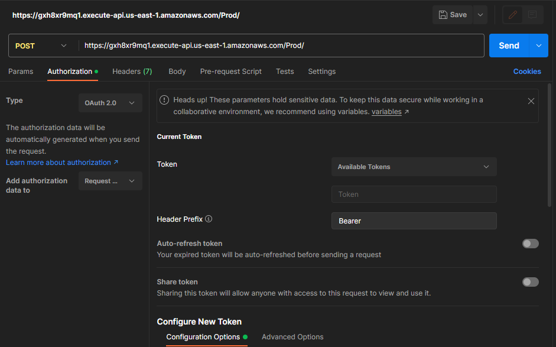

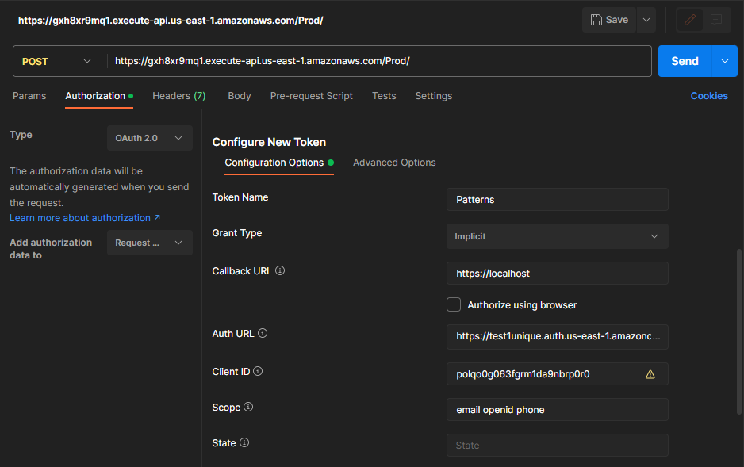

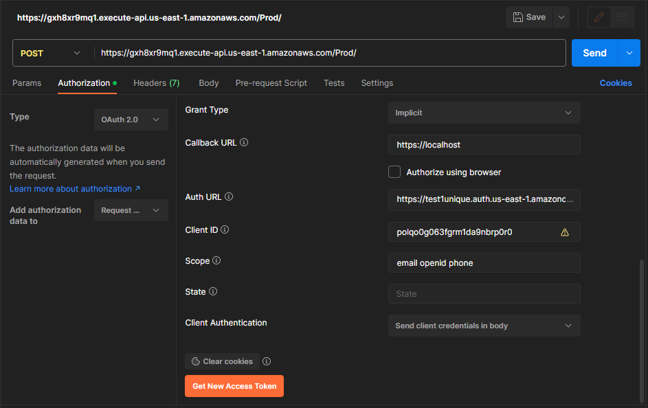

Now Click on the ```Generate```

Login Screen pops up.
Sign up with your email
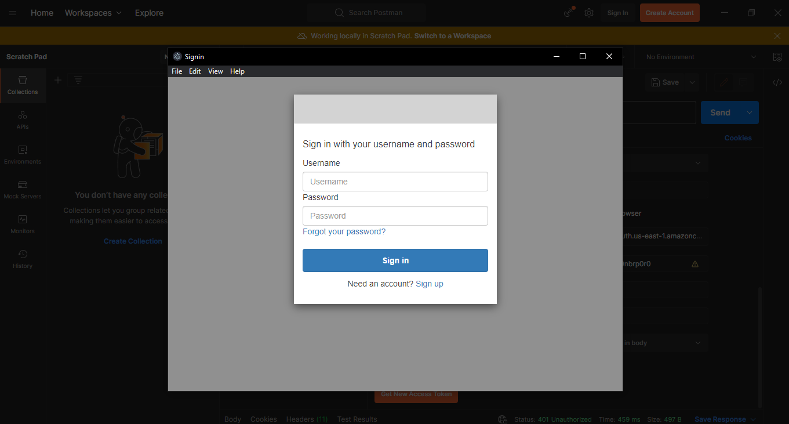

Another screen with pop that contains the IdToken and AccessToken
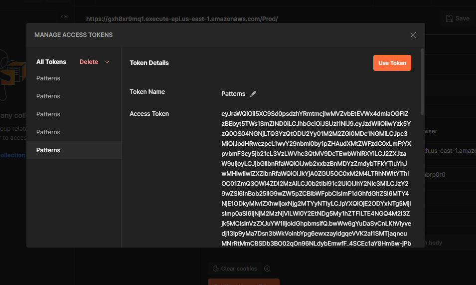

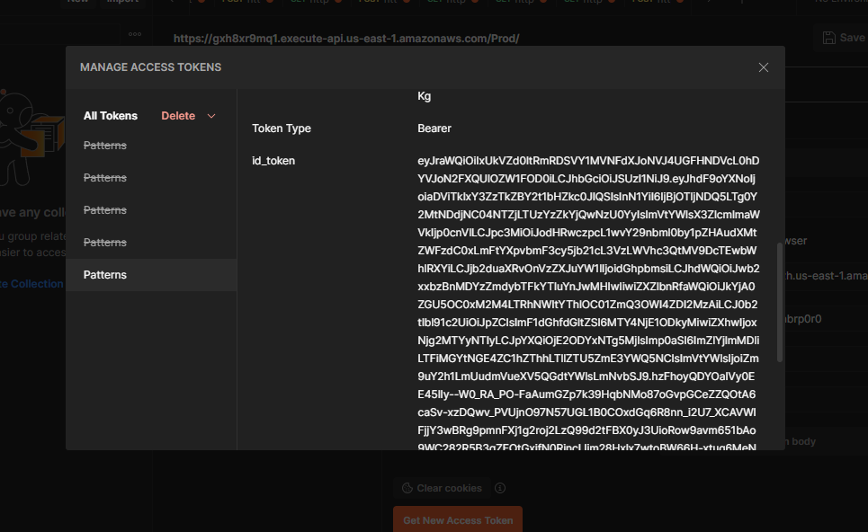

Copy the IdToken and change the ```type``` to ```Bearee token``` 
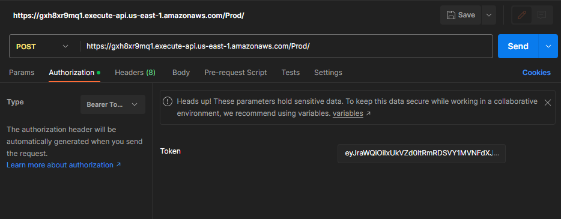

Paste the copied token on the space for ```Token```

Once you are done you can click on send.


Open postman and send a post request to your end point.


<!--AWSTemplateFormatVersion: '2010-09-09'
    Transform: AWS::Serverless-2016-10-31
    Description: Serverless patterns - Amazon API Gateway to AWS Lambda to Amazon DynamoDB

    Resources:
        MyApi:
            Type: AWS::Serverless::Api
            Properties:
            StageName: Prod
            Cors: "'*'"
            Auth:
                DefaultAuthorizer: CognitoAuthorizer
                Authorizers:
                CognitoAuthorizer:
                    UserPoolArn: arn:aws:cognito-idp:us-east-1:132260253285:userpool/us-east-1_Cq10mheEv

Use code with caution. Learn more
This application defines a single Lambda function called HelloWorldFunction. The function is defined to use the Python 3.8 runtime and is triggered by an API Gateway endpoint at /hello.

To build and deploy this application, use the following commands:

Code snippet
```sam build```
```sam deploy```

Use code with caution. Learn more
These commands will create a ZIP file that contains the application code and dependencies, and then deploy the application to AWS.

Once the application is deployed, you can test it by making a GET request to the /hello endpoint. For example, you can use the following curl command:

Code snippet
curl https://<API_ENDPOINT>/hello
Use code with caution. Learn more
This command will return the following response:

Co -->