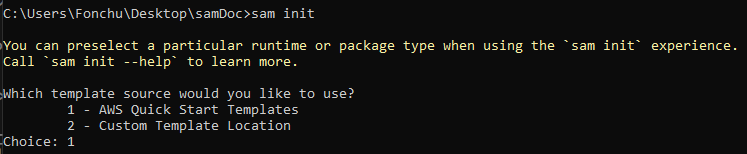
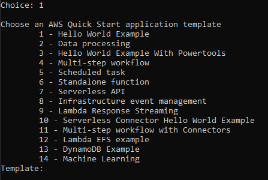
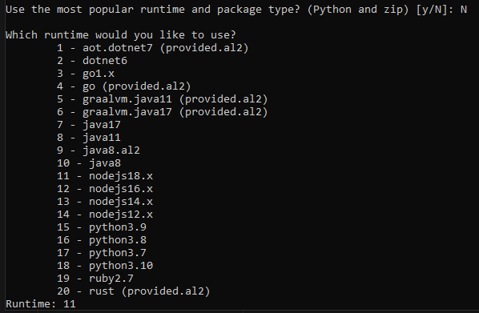
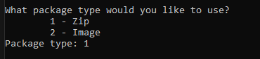
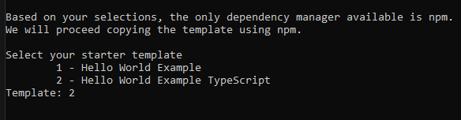
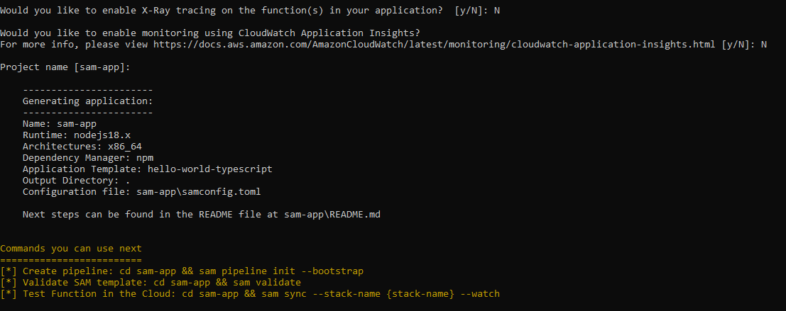
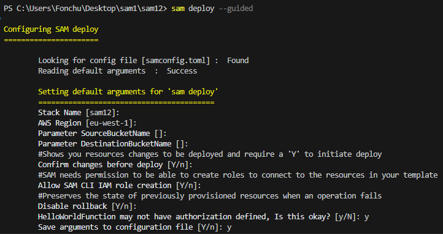
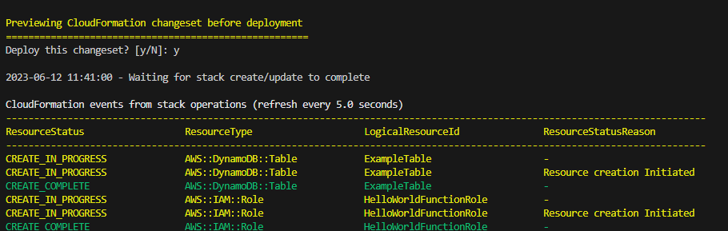
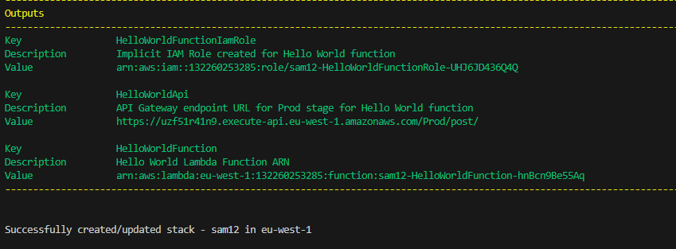
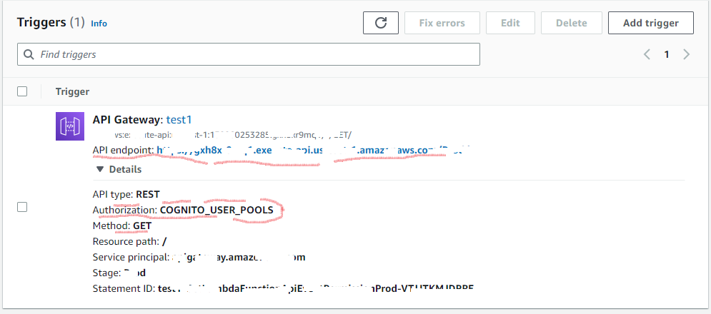

## Building A Secured CRUD API with Severless Architecture.

By the end of this post, you should be able to create a serverless secured api.

#### Requirements
1. [AWS Account](https://aws.amazon.com/)
2. [AWS Command Line Interface (AWS CLI)](https://awscli.amazonaws.com/AWSCLIV2.msi)
3. [SAM CLI](https://github.com/aws/aws-sam-cli/releases/latest/download/AWS_SAM_CLI_64_PY3.msi)
4. [NodeJs.](https://nodejs.org/en/download)
5. [VS Code](https://code.visualstudio.com/download) or Your favourite text editor.
   

#### AWS Services used in this project
1. [SAM IaC](https://aws.amazon.com/serverless/sam/): The AWS Serverless Application Model (SAM) is an open-source framework for building serverless applications. It provides shorthand syntax to express functions, APIs, databases, and event source mappings. With just a few lines per resource, you can define the application you want and model it using YAML. There is no additional charge to use AWS SAM. You pay for the AWS resources created using SAM in the same manner as if you created them manually. You only pay for what you use, as you use it. There are no minimum fees and no required upfront commitments.
2. [Cognito](https://aws.amazon.com/cognito/): With Amazon Cognito, you can add user sign-up and sign-in features and control access to your web and mobile applications. This service is free for less than 50,000 MAUs(monthly active users)
3. [API Gateway](https://aws.amazon.com/api-gateway/):Amazon API Gateway is a fully managed service that makes it easy for developers to create, publish, maintain, monitor, and secure APIs at any scale. With Amazon API Gateway, you only pay when your APIs are in use. There are no minimum fees or upfront commitments
4. [Lambda](https://aws.amazon.com/lambda/) : AWS Lambda is a serverless, event-driven compute service that lets you run code for virtually any type of application or backend service without provisioning or managing servers. You can trigger Lambda from over 200 AWS services and software as a service (SaaS) applications, and only pay for what you use. Cost of using lambda functions.
 

#### Programming language use
1. Typescript.

Before going over this blog, it is assumed that you basic knowledge on Typescript and Severless Architectures with AWS.


###Lets Dive-in
To get this up and running, do the following.

1. Initialize a new SAM application. Use the ```sam init``` command to initialize a new SAM application in your terminal and provide answers as required.
2. Select starter template
   
   

3. Choose an AWS Quick Start application template. Select option 1.

   

4. Choose a runtime environment. Select option 11 for latest nodeJs version.

    

5. What package type would you like to use? Choose the you like but I will go for Zip



6. Starter Template. Choose option 2 for typescript template



7. Provide the name for your application.



8. Open the project folder with your favorite text editor.

        projectName
        ├── event
            ├── events.json
        ├── hello_world
            ├── coverage
            ├── tests
            ├── .eslintingnore
            ├── .eslintrc.js
            ├── .npmignore
            ├── .prettierrc.js
            ├── app.ts
            ├── jest.config.ts
            ├── .prettierrc.js
            ├── .package.json
            ├── tsconfig.json
        ├── test
        ├── samconfig.toml
        ├── README.md
        └── template.yaml

In the terminal and your root directory, run the following commands

9. To test your project, run ```npm run test```
10. To compile, run ```npm run compile```
11. To use auto arrange your code, run ```npm run lint```
12. Run the command ```sam build``` or ```sam build --beta-features```  to build your application
13. Run ```sam deploy --guided``` to deploy your application. And provide the neccessary info as requested.





CloudFormation stack and the output.


Visit the link (value) in the output you will get ```{"message":"hello world"}```

#### Now lets modify the default application.

1. Change the name of the ```hello-world``` folder to whatever you want and open it in your terminal.
2. Type the command ```npm install @aws-sdk/client-dynamodb``` Library for accessing dynamoDb.
3. Open ```app.ts``` and add the following import statement.
   ```import { DynamoDBClient, GetItemCommand, PutItemCommand, QueryCommand, ScanCommand } from "@aws-sdk/client-dynamodb"; ```
.
   ```DynamoDBClient``` to instantiate dynamoDb.
   ```GetItemCommand``` to get specific items.
   ```PutItemCommand``` to update or create new items.
   ```QueryCommand``` to get items satisfying given conditions.
   ```ScanCommand``` to get everything from the database.
4. Instantiate dynamodbclient by adding the following code after your imported libraries.

```const client = new DynamoDBClient({ region: "eu-west-1" });```

##### Adding item to dynamodb 
5. Create ```itemInsert``` function to create a dynamodb item by adding the following code. 

    ```typescript
    export const postItem = async (event: APIGatewayProxyEvent): Promise<APIGatewayProxyResult> => {
        var blog_id = Math.floor(Math.random() * 1000).toString(); 
        var params = {
            "Item":{
                "id":{
                    "S": blog_id
                },
                "title": {
                    "S":  "Title of a blog post"
                },
                "body": {
                    "S":  "Body of the blog post."
                }
            },
            "TableName": 'sam12-ExampleTable-4DPPPE0DQOO4',
            "ReturnConsumedCapacity": "TOTAL",
        };
        let response: APIGatewayProxyResult;
            try {
                const test = await client.send(new PutItemCommand(params))
                console.log("Hello world",test)
                response = {
                    statusCode: 200,
                    body: JSON.stringify({
                        message: 'Item created successfully',
                    }),
                };
            } catch (err: unknown) {
                console.log(err);
                response = {
                    statusCode: 500,
                    body: JSON.stringify({
                        message: err instanceof Error ? err.message : 'some error happened',
                    }),
                };
            }
            return response; 
        
    };
    ```

Go to ```template.yaml``` and add the dynamodb ```resource```

  ```yaml
    ExampleTable:
        Type: "AWS::DynamoDB::Table"
        Properties:
        TableName: sam12-ExampleTable-4DPPPE0DQOO4
        AttributeDefinitions:
            - AttributeName: "id"
            AttributeType: "S"
        KeySchema:
            - AttributeName: "id"
            KeyType: "HASH"
        ProvisionedThroughput:
            ReadCapacityUnits: 1
            WriteCapacityUnits: 1
  ```
Run ```sam build``` and then the ```sam deploy``` or ```sam deploy --guided```

you will recieve the following response.
```{"message":"Item inserted successfully"}```

##### Getting Items from dynamodb
1. To get Items from dynamoDb, adjust your ```lambdahandler``` function to the code bellow

```typescript
    export const lambdaHandler = async (event: APIGatewayProxyEvent): Promise<APIGatewayProxyResult> => {
        let response: APIGatewayProxyResult;
            try {
                const test = await client.send(new ScanCommand({
                    TableName: 'sam12-ExampleTable-4DPPPE0DQOO4'
                }))
                response = {
                    statusCode: 200,
                    body: JSON.stringify(test.Items),
                };
            } catch (err: unknown) {
                console.log(err);
                response = {
                    statusCode: 500,
                    body: JSON.stringify({
                        message: err instanceof Error ? err.message : 'some error happened',
                    }),
                };
            }
            return response; 
        
    };
  ```
Run ```sam build``` and then the ```sam deploy``` or ```sam deploy --guided```

```[{"id":"744","title":"Title of a blog post","body":"Title of a blog post"}]```


##### Deleting Items from dynamodb

To delete item from dynamodb, create the following lambda function.

```typescript
export const deleteItem = async (event: APIGatewayProxyEvent): Promise<APIGatewayProxyResult> => {
    let response: APIGatewayProxyResult;
    try {
        const test = await client.send(new DeleteItemCommand({
            TableName: 'sam12-ExampleTable-4DPPPE0DQOO4',
            Key:{
                id:{
                    "S":event.body.id
                }
            }
        }))
        response = {
            statusCode: 200,
            body: JSON.stringify(
                {
                    message: 'Item deleted successfully',
                }
            ),
        };
    } catch (err: unknown) {
        console.log(err);
        response = {
            statusCode: 500,
            body: JSON.stringify({
                message: err instanceof Error ? err.message : 'some error happened',
            }),
        };
    }
    return response;
};
```

Open PostMan and send a delete request to your API and provide the id of the item you want to delete in the body.

#### To update a specific Item
Add the following function to ```app.ts``` file.

   ```typescript
    export const updateItem = async (event: APIGatewayProxyEvent): Promise<APIGatewayProxyResult> => {
        var blog_id = Math.floor(Math.random() * 1000).toString(); 
        var params = {
            "Item":{
                "id":{
                    "S": event.body.id
                },
                "title": {
                    "S":  event.body.title
                },
                "body": {
                    "S":  event.body.body
                }
            },
            "TableName": 'sam12-ExampleTable-4DPPPE0DQOO4',
            "ReturnConsumedCapacity": "TOTAL",
        };
        let response: APIGatewayProxyResult;
            try {
                const test = await client.send(new PutItemCommand(params))
                console.log("Hello world",test)
                response = {
                    statusCode: 200,
                    body: JSON.stringify({
                        message: 'Item created successfully',
                    }),
                };
            } catch (err: unknown) {
                console.log(err);
                response = {
                    statusCode: 500,
                    body: JSON.stringify({
                        message: err instanceof Error ? err.message : 'some error happened',
                    }),
                };
            }
            return response; 
        
    };
  ```

Also update ```template.yaml``` file by adding this function resource.

  ```yaml
    UpdateItem:
        Type: AWS::Serverless::Function
        Properties:
        CodeUri: hello-world/
        Handler: app.updateItem
        Runtime: nodejs14.x
        Architectures:
            - x86_64
        Events:
            HelloWorld:
            Type: Api 
            Properties:
                Path: /post
                Method: put
        Policies:
            - DynamoDBCrudPolicy:
                TableName: !Ref ExampleTable
  ```

Now we have the APIs perform the basic crud methods. But we have a problem in that everyone can access our APIs. So lets add Cognito authorizer to the API such that only authorize persons can access the our API.

#### Adding Amazon Cognito to secure our API from public access.

1. Head over to aws console and create a cognito user  pool. If you don't know how to do this, click [here]() a walk through guide.
2. Open ```template.yaml``` and add the following code in ```resouces```

```yaml
  MyApi:
    Type: AWS::Serverless::Api
    Properties:
      StageName: Prod
      Cors: "'*'"
      Auth:
        DefaultAuthorizer: CognitoAuthorizer
        Authorizers:
          CognitoAuthorizer:
            UserPoolArn: arn:aws:cognito-idp:eu-west-1:132260253285:userpool/eu-west-1_dDfqIG226
```
The above code saves as your RestApiKey.

3. Add cognito userpool resource

```yaml
  MyCognitoUserPool:
    Type: AWS::Cognito::UserPool
    Properties:
      UserPoolName: userPoolName
      Policies:
        PasswordPolicy:
          MinimumLength: 8
      UsernameAttributes:
        - email
      Schema:
        - AttributeDataType: String
          Name: email
          Required: false
```

4. Add cognito user pool client resoure

```yaml
  MyCognitoUserPoolClient:
    Type: AWS::Cognito::UserPoolClient
    Properties:
      UserPoolId: userPoolId
      ClientName: clientName
      GenerateSecret: false
```

5. Your final ```yaml``` file should look as such.

```yaml
AWSTemplateFormatVersion: '2010-09-09'
Transform: AWS::Serverless-2016-10-31
Description: >
  sam12

  Sample SAM Template for sam12
  
Globals:
  Function:
    Timeout: 3
    MemorySize: 128
Parameters:
  SourceBucketName:
    Type: String
  DestinationBucketName:
    Type: String

Resources:
  MyApi:
    Type: AWS::Serverless::Api
    Properties:
      StageName: Prod
      Cors: "'*'"
      Auth:
        DefaultAuthorizer: CognitoAuthorizer
        Authorizers:
          CognitoAuthorizer:
            UserPoolArn: arn:aws:cognito-idp:eu-west-1:132260253285:userpool/eu-west-1_dDfqIG226

  GetItemFunction:
    Type: AWS::Serverless::Function 
    Properties:
      CodeUri: hello-world/
      Handler: app.lambdaHandler
      Runtime: nodejs14.x
      Architectures:
        - x86_64
      Events:
        GetRoot:
          Type: Api
          Properties:
            RestApiId: !Ref MyApi
            Path: /post
            Method: get
      Policies:
        - AmazonDynamoDBFullAccess
        - DynamoDBCrudPolicy:
            TableName: !Ref ExampleTable

  InsertItem:
    Type: AWS::Serverless::Function
    Properties:
      CodeUri: hello-world/
      Handler: app.insertItem
      Runtime: nodejs14.x
      Architectures:
        - x86_64
      Events:
        GetRoot:
          Type: Api
          Properties:
            RestApiId: !Ref MyApi
            Path: /post
            Method: post
      Policies:
        - DynamoDBCrudPolicy:
            TableName: !Ref ExampleTable

  DeleteItem:
    Type: AWS::Serverless::Function
    Properties:
      CodeUri: hello-world/
      Handler: app.deleteItem
      Runtime: nodejs14.x
      Architectures:
        - x86_64
      Events:
        HelloWorld:
          Type: Api 
          Properties:
            RestApiId: !Ref MyApi
            Path: /post
            Method: delete
      Policies:
        - DynamoDBCrudPolicy:
            TableName: !Ref ExampleTable

  UpdateItem:
    Type: AWS::Serverless::Function
    Properties:
      CodeUri: hello-world/
      Handler: app.deleteItem
      Runtime: nodejs14.x
      Architectures:
        - x86_64
      Events:
        HelloWorld:
          Type: Api 
          Properties:
            RestApiId: !Ref MyApi
            Path: /post
            Method: put
      Policies:
        - DynamoDBCrudPolicy:
            TableName: !Ref ExampleTable

    Metadata: # Manage esbuild properties
      BuildMethod: esbuild
      BuildProperties:
        Minify: true
        Target: "es2020"
        EntryPoints: 
        - app.ts

  ExampleTable:
    Type: "AWS::DynamoDB::Table"
    Properties:
      TableName: sam12-ExampleTable-4DPPPE0DQOO4
      AttributeDefinitions:
        - AttributeName: "id"
          AttributeType: "S"
      KeySchema:
        - AttributeName: "id"
          KeyType: "HASH"
      ProvisionedThroughput:
        ReadCapacityUnits: 1
        WriteCapacityUnits: 1

  MyCognitoUserPool:
    Type: AWS::Cognito::UserPool
    Properties:
      UserPoolName: test1
      Policies:
        PasswordPolicy:
          MinimumLength: 8
      UsernameAttributes:
        - email
      Schema:
        - AttributeDataType: String
          Name: email
          Required: false
  
  MyCognitoUserPoolClient:
    Type: AWS::Cognito::UserPoolClient
    Properties:
      UserPoolId: eu-west-1_dDfqIG226
      ClientName: test1
      GenerateSecret: false
  ## Lambda function
Outputs:
  HelloWorldApi:
    Description: "API Gateway endpoint URL for Prod stage for Hello World function"
    Value: !Sub "https://${ServerlessRestApi}.execute-api.${AWS::Region}.amazonaws.com/Prod/post/"
  HelloWorldFunction:
    Description: "Hello World Lambda Function ARN"
    Value: !GetAtt HelloWorldFunction.Arn
  HelloWorldFunctionIamRole:
    Description: "Implicit IAM Role created for Hello World function"
    Value: !GetAtt HelloWorldFunctionRole.Arn
```

Once you are set,

run ```sam build``` to build your final project.

```sam deploy --guided``` to deploy your final project.

Your API is now available and secured once your deployment is done.

Go to ```aws console``` search for ```lambda``` you will see all the lambda functions you created.

Click one of the functions you just created either ``GetItem``, ```UpdateItem```, ```DeleteItem``` or ```CreateItem```, APIGATEWAY is linked to the function as a ```Trigger```, Click on the APIGATEWAY, scroll down and click on details



You can make request on the ```API endpoint``` provided