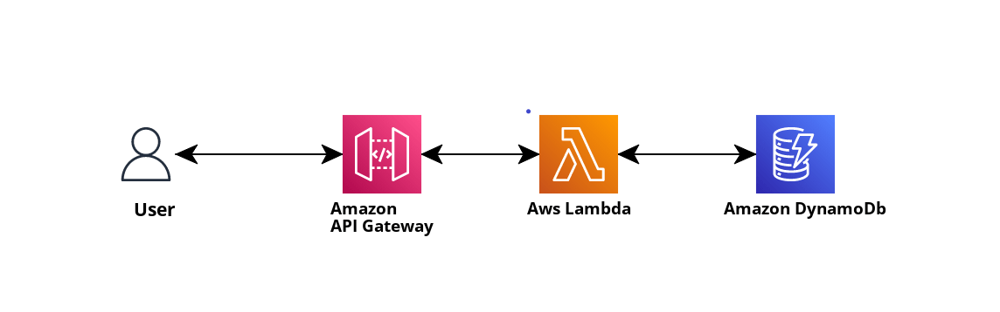

# Introduction to SST.

In AWS, `SST` stands for `Serverless Stack`. It is an `open source framework` that makes it easy to build `serverless` applications on `AWS`. `SST` is based on the `AWS` `Cloud Development Kit (CDK)`, and it provides a number of features that makes it easier to `develop` and `deploy serverless applications`. Learn more about SST [here..]().

---

##### BUILDING A WEATHER API USING AMAZON API GATEWAY, LAMBDA, AMAZON DYNAMODB USING TYPESCRIPT AS THE PROGRAMING LANGUAGE AND SST.


**Problem**
We need to build a `weather API` that can be used to get and store weather information for any location in the world. The API should be easy to use and scalable, and it should be able to handle a high volume of requests.

**Solution**: 
We will use `Amazon API Gateway` to create a `RESTful` `API` that can be used to interact with the `Lambda function`. The `Lambda function` will use `Amazon DynamoDB` to store and retrieve the `weather data`. `TypeScript` will be used to develop the `API and Lambda function.`

**Benefits**
The benefits of this solution include:
1. Learn how to use `AWS` services to build a `RESTful API`
2. `Easy to use`: The API will be easy to use for developers and end users.
3. `Scalable`: The API can be scaled to handle a high volume of requests.
4. `Cost-effective`: The solution will be cost-effective to implement and maintain.


Here are some specific tasks that need to be completed in order to implement this solution:

1. Create an Amazon API Gateway RESTful API.
2. Create a Lambda function that will fetch weather data from a third-party API.
3. `Store` the weather data in `Amazon DynamoDB`.
4. `Get` weather data from `Amazon DynamoDB`.
5. `Update` weather data in `Amazon DynamoDB`.
6. `Delete` the weather data from `Amazon DynamoDB`.
7. Integrate the `Lambda function` with the `API Gateway RESTful API`.
8. Test the API.

---

**Requirements**
1. [AWS Account](https://aws.amazon.com/). Amazon Web Services (AWS) is the world's most comprehensive and broadly adopted cloud, offering over 200 fully featured services from data centers globally.
2. [AWS Command Line Interface (AWS CLI)](https://awscli.amazonaws.com/AWSCLIV2.msi). The AWS CLI provides direct access to the public APIs of AWS services. You can explore a service's capabilities with the AWS CLI, and develop shell scripts to manage your resources
3. [ NodeJs](https://github.com/aws/aws-sam-cli/releases/latest/download/AWS_SAM_CLI_64_PY3.msi). 
   
4. [Typescript](https://www.python.org/ftp/python/3.11.4/python-3.11.4-amd64.exe). The programming language used in this project
5. [VS Code](https://code.visualstudio.com/download) or Your favourite text editor.
6. [Postman](https://www.postman.com/downloads/). Postman is an API platform for building and using APIs. Postman simplifies each step of the API lifecycle and streamlines collaboration so you can create better APIs—faster.

---

**AWS Services Used**

1. [SST](https://docs.sst.dev/) In AWS, SST stands for Serverless Stack. It is an open source framework that makes it easy to build serverless applications on AWS. SST is based on the AWS Cloud Development Kit (CDK), and it provides a number of features that make it easier to develop and deploy serverless applications
2. [Amazon API Gateway](https://aws.amazon.com/api-gateway/): Amazon API Gateway is a fully managed service that makes it easy for developers to create, publish, maintain, monitor, and secure APIs at any scale. With Amazon API Gateway, you only pay when your APIs are in use. There are no minimum fees or upfront commitments
3. [AWS Lambda](https://aws.amazon.com/lambda/) : AWS Lambda is a serverless, event-driven compute service that lets you run code for virtually any type of application or backend service without provisioning or managing servers. You can trigger Lambda from over 200 AWS services and software as a service (SaaS) applications, and only pay for what you use. Cost of using lambda functions.

**The Diagram**




### **Let's Get Started**

1. Create a new folder and open in your terminal.
2. Run the command `npx create-sst@latest --template=base/example rest-api-ts` 
3. Navigate into the project folder `cd rest-api-ts` run the command
`npm install` to install the required packages.

`package.json`

```json
{
  "scripts": {
    "dev": "sst dev",
    "build": "sst build",
    "deploy": "sst deploy",
    "remove": "sst remove",
    "console": "sst console",
    "typecheck": "tsc --noEmit"
  },
  "devDependencies": {
    "sst": "^2.16.2",
    "aws-cdk-lib": "2.84.0",
    "constructs": "10.1.156",
    "typescript": "^5.1.3",
    "@tsconfig/node16": "^1.0.4"
  },
  "workspaces": [
    "packages/*"
  ]
}
  ```

The `scripts` block specifies `npm` commands used in the project. `npm run dev` `builds` and `deploys` the aplicatation. `npm run build` builds the project that can build deployed. `npm run deploy` deploys the build project to `AWS cloud account`. `npm run remove` delete the deployed stack from `cloudFormation`

The `devDependencies` block specifies the libraries used in the project.

By default, our app will be deployed to the us-east-1 AWS region. This can be changed in the sst.config.ts in your project root.

```typescript
import { SSTConfig } from "sst";

export default {
  config(_input) {
    return {
      name: "rest-api-ts",
      region: "us-east-1",
    };
  },
} satisfies SSTConfig;
  ```

`name` specifies the name of your application, `region` specifies the region that the application will be deployed in.

**Project layout**
An SST app is made up of two parts.

- stacks/ — App Infrastructure

The code that describes the infrastructure of your serverless app is placed in the stacks/ directory of your project. SST uses AWS CDK, to create the infrastructure.

- packages/functions/ — App Code

The code that’s run when your API is invoked is placed in the packages/functions/ directory of your project.

`stacks/ExampleStack.ts` edit the `EsampleStack.ts` to `WeatherStack.ts`.

**Lets create enpoints**
Open `WeatherStack.js` and paste the following code to setup `routes` and `http mothods`.

From `sst/construct` library that provided all `AWS services` needed for this project, lets import `Api` that enables us to create `REST API` and specify `routes` for our `endpoints` that can be consumed by the front end, `StackContext` and `Table` object that allows us to specify `dynamodb table` properties such as `name`, `fields`, `primaryIndex`.


```typescript

import { Api, StackContext, Table } from "sst/constructs";

export function WeatherCrudStack({ stack }: StackContext) {
  const table = new Table(stack, "weatherDataSST", {
    fields: {
      id: "string",
    },
    primaryIndex: { partitionKey: "id" },
  });

  const api = new Api(stack, "api", {
    defaults: {
      function: {
        bind: [table]
      }
    },
    routes: {
      "post /weather": "packages/functions/src/createWeather.main",
      "get /weather": "packages/functions/src/getWeathers.main",
      "get /weather/{id}": "packages/functions/src/getSingleWeather.main",
      "put /weather/{id}": "packages/functions/src/updateWeather.main",
      "delete /weather/{id}": "packages/functions/src/deleteWeather.main",
    },
  });

  // show the api endpoint in the output
  stack.addOutputs({
    apiendpoint: api.url,
  });
}
```

`table` holds information for `dynamodb table`, `api` holds our `Restapi` information and the `routes` to different endpoints, `stack.addOutputs` specifies the information to be printed on the local console when the  `app` is successfully deployed.

`/weather` Route to create weather item using `http method` `POST`

`/weather` Route to fetch all weather items from `dynamodb` using `http method` `GET`

`/weather/{id}` Route to fetch a single weather item using `http method` `GET`

`/weather/{id}` Route to update weather item in dynamodb using `http method` `PUT`.

`/weather/{id}` Route to delete weather item from dynamodb using `http method` `PUT`.

**Creating lambda functions to perform the CRUD methods**

###### Create weather item lambda function

```typescript
import { DynamoDB } from "aws-sdk";
import { APIGatewayProxyEvent, APIGatewayProxyResult } from "aws-lambda";

const dynamoDb = new DynamoDB.DocumentClient();
const tableName = process.env.TABLENAME
export async function main(
  event: any
): Promise<APIGatewayProxyResult> {
  const weatherId = Math.floor(Math.random() * 1000).toString();
  const weather = JSON.parse(event.body).weather
  const town = JSON.parse(event.body).town;
  const data = {
    id: weatherId,
    weather: weather,
    town: town
  }
  const response = await dynamoDb.put({Item: data, TableName: tableName}).promise()

  console.log("response", response)
  if(response !== null) {
    return {
      statusCode: 500,
      body: JSON.stringify({
        "message": "failed to create weather"
      })
    }
  }
  return {
    statusCode: 200,
    body: JSON.stringify({
        "message": "successfully created weather"
    }),
  };
}
```

###### Fetch all weather item lambda function

```typescript
import { DynamoDB } from "aws-sdk";
import { APIGatewayProxyEvent, APIGatewayProxyResult } from "aws-lambda";

const dynamoDb = new DynamoDB.DocumentClient();
const tableName = process.env.TABLENAME
export async function main(
  event: APIGatewayProxyEvent
): Promise<APIGatewayProxyResult> {
  console.log(tableName)
  const weatherData = await dynamoDb.scan({ TableName: tableName }).promise();
  if(weatherData.Items == null)
    return {
      statusCode: 404,
      body: JSON.stringify({
        message: "No weather data found",
      }),
    }
  let weatherItems = weatherData.Items;
  
  return {
    statusCode: 200,
    body: JSON.stringify(weatherItems),
  };
}
```


###### Fetch single weather item lambda function


```typescript
import { DynamoDB } from "aws-sdk";
import { APIGatewayProxyEvent, APIGatewayProxyResult } from "aws-lambda";

const dynamoDb = new DynamoDB.DocumentClient();
const tableName = process.env.TABLENAME
export async function main(
  event: APIGatewayProxyEvent
): Promise<APIGatewayProxyResult> {
  const weatherId = event.pathParameters && event.pathParameters.id
      ? event.pathParameters.id
      : null;
  const weatherItem = await dynamoDb.get({
    TableName: tableName,
    Key: {
      id: weatherId,
    },
  }).promise();
  if (!weatherItem || !weatherItem.Item) {
    return{
      statusCode: 404,
      body: JSON.stringify({
        message: "No weather data found",
      }),
    }
  }
  return {
    statusCode: 200,
    body: JSON.stringify(weatherItem),
  };
}
```


##### Lambda function to update an item in dynamodb

```typescript
import { DynamoDB } from "aws-sdk";
import { APIGatewayProxyEvent, APIGatewayProxyResult } from "aws-lambda";

const dynamoDb = new DynamoDB.DocumentClient();
const tableName = process.env.TABLENAME
export async function main(
  event: APIGatewayProxyEvent
): Promise<APIGatewayProxyResult> {
  const weatherId =
    event.pathParameters && event.pathParameters.id
      ? event.pathParameters.id
      : null;

  if (!weatherId) {
    return {
      statusCode: 404,
      body: JSON.stringify({ error: true }),
    };
  }

  if (event.body) {
    const data = {
      id: weatherId,
      weather: JSON.parse(event.body).weather?JSON.parse(event.body).weather: null,
      town: JSON.parse(event.body).town?JSON.parse(event.body).town: null,
    };

    const res = dynamoDb.put({TableName:tableName, Item: data}).promise()
    if(res == null)
      return {
        statusCode: 200,
        body: JSON.stringify({
          "message": "Weather updated successfully"
        }),
      };
    else
      return{
        statusCode: 404,
        body: JSON.stringify({
          message: "No weather data found",
        }),
      }
  }

  return {
    statusCode: 500,
    body: JSON.stringify({
      "message": "Weather failed to update"
    }),
  };
}
  ```

##### Lambda function to `delete` an item from dynamodb

```typescript

import { DynamoDB } from "aws-sdk";
import { APIGatewayProxyEvent, APIGatewayProxyResult } from "aws-lambda";

const dynamoDb = new DynamoDB.DocumentClient();
const tableName = process.env.TABLENAME
export async function main(
  event: APIGatewayProxyEvent
): Promise<APIGatewayProxyResult> {
  const weatherId =
    event.pathParameters && event.pathParameters.id
      ? event.pathParameters.id
      : null;

  if (!weatherId) {
    return {
      statusCode: 404,
      body: JSON.stringify({ error: true }),
    };
  }else{
    dynamoDb.delete({TableName:tableName, Key:{
        id: weatherId
    }}).promise()
    return {
      statusCode: 200,
      body: JSON.stringify({
        "message": "Weather deleted successfully"
      }),
    };
  }
}
  ```